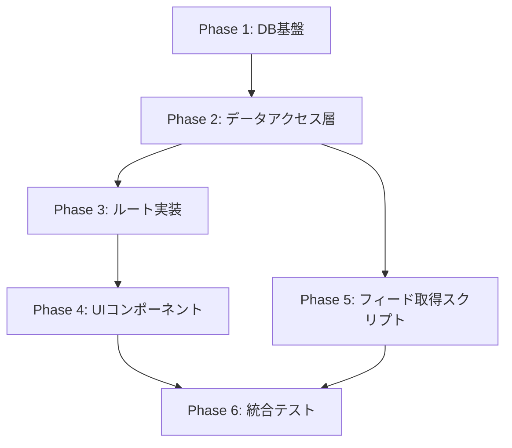

# RSSフィードアグリゲーター機能 実装計画書

## 1. 概要

設計書に基づき、RSSフィードアグリゲーター機能を段階的に実装する計画を定義する。

## 2. 実装フェーズ

### Phase 1: データベース基盤構築

**目的**: データモデルの実装とマイグレーション

1. Drizzle ORMスキーマ定義
   - `database/schema.ts`に新規テーブル追加
   - 型定義の作成

2. マイグレーション生成・実行
   - `pnpm db:generate`でマイグレーション生成
   - `pnpm db:migrate`でローカル環境に適用
   - 動作確認

### Phase 2: データアクセス層実装

**目的**: データベース操作関数の実装

1. フィード管理関数（`app/lib/feeds/`）
   - `createFeed()` - フィード作成
   - `getUserFeeds()` - ユーザーのフィード取得
   - `updateFeed()` - フィード更新
   - `deleteFeed()` - フィード削除
   - `getFeedCount()` - フィード数カウント

2. 記事管理関数（`app/lib/articles/`）
   - `createArticle()` - 記事作成
   - `getArticlesByFeedIds()` - フィードIDで記事取得
   - `getTimelineArticles()` - タイムライン記事取得
   - `checkArticleExists()` - 記事重複チェック

3. 購読管理関数（`app/lib/subscriptions/`）
   - `subscribeToUser()` - ユーザー購読
   - `unsubscribeFromUser()` - ユーザー購読解除
   - `subscribeToTeam()` - チーム購読
   - `unsubscribeFromTeam()` - チーム購読解除
   - `getUserSubscriptions()` - 購読一覧取得
   - `isSubscribedToUser()` - ユーザー購読状態確認
   - `isSubscribedToTeam()` - チーム購読状態確認

### Phase 3: ルート実装

**目的**: React Routerのルートとloader/actionの実装

1. フィード管理ルート
   - `/feeds` - フィード一覧・新規登録
   - `/feeds/:id/edit` - フィード編集・削除

2. 購読管理ルート
   - `/subscriptions` - 購読一覧表示

3. 既存ルートの拡張
   - `/users/:userId` - 記事表示と購読機能追加
   - `/teams/:slug` - 記事表示と購読機能追加
   - `/` - タイムライン機能追加

### Phase 4: UIコンポーネント実装

**目的**: ユーザーインターフェースの構築

1. フィード管理コンポーネント
   - `FeedList` - フィード一覧
   - `FeedForm` - フィード登録フォーム
   - `FeedEditForm` - フィード編集フォーム

2. 購読管理コンポーネント
   - `SubscriptionList` - 購読一覧
   - `SubscribeButton` - 購読ボタン

3. 記事表示コンポーネント
   - `ArticleList` - 記事一覧
   - `ArticleCard` - 記事カード
   - `ArticlePagination` - ページネーション

### Phase 5: フィード取得スクリプト実装

**目的**: RSSフィードの自動取得機能

1. フィード取得スクリプト（`scripts/fetch-feeds.ts`）
   - RSSパーサーライブラリの導入
   - D1データベース接続設定
   - 並行実行制御
   - エラーハンドリング
   - OpenGraph画像URL取得

2. GitHub Actions設定
   - `.github/workflows/fetch-feeds.yml`作成
   - シークレット設定（Cloudflare認証情報）

### Phase 6: 統合テストと最適化

**目的**: 全体動作確認と最適化

1. 統合テスト
   - フィード登録から記事表示までのフロー確認
   - 購読機能の動作確認
   - パフォーマンステスト

2. 最適化
   - クエリ最適化
   - キャッシュ実装
   - エラーハンドリング改善

## 3. 実装順序と依存関係



## 4. 各フェーズの詳細タスク

### Phase 1 詳細（推定時間: 2時間）

1. `database/schema.ts`に以下を追加:
   - `feeds`テーブル定義
   - `articles`テーブル定義
   - `userSubscriptions`テーブル定義
   - `teamSubscriptions`テーブル定義
2. 型エクスポート追加
3. マイグレーション実行とテーブル作成確認

### Phase 2 詳細（推定時間: 4時間）

1. ディレクトリ構造:
   ```
   app/lib/
   ├── feeds/
   │   ├── index.ts
   │   └── interface.ts
   ├── articles/
   │   ├── index.ts
   │   └── interface.ts
   └── subscriptions/
       ├── index.ts
       └── interface.ts
   ```
2. 各関数にcurryingパターン適用
3. エラーハンドリング実装
4. 型安全性確保

### Phase 3 詳細（推定時間: 3時間）

1. 新規ルートファイル:
   - `app/routes/feeds.tsx`
   - `app/routes/feeds.$id.edit.tsx`
   - `app/routes/subscriptions.tsx`
2. 既存ルート修正:
   - `app/routes/_index.tsx`
   - `app/routes/users.$userId.tsx`
   - `app/routes/teams.$slug.tsx`
3. `app/routes.ts`への登録

### Phase 4 詳細（推定時間: 4時間）

1. コンポーネントディレクトリ:
   ```
   app/components/
   ├── feeds/
   │   ├── FeedList.tsx
   │   ├── FeedForm.tsx
   │   └── FeedEditForm.tsx
   ├── subscriptions/
   │   ├── SubscriptionList.tsx
   │   └── SubscribeButton.tsx
   └── articles/
       ├── ArticleList.tsx
       ├── ArticleCard.tsx
       └── ArticlePagination.tsx
   ```
2. shadcn/uiコンポーネント活用
3. レスポンシブデザイン対応

### Phase 5 詳細（推定時間: 3時間）

1. 必要なパッケージ追加:
   - `rss-parser`または`fast-xml-parser`
   - `node-html-parser`（OpenGraph取得用）
2. スクリプト実装:
   - Cloudflare D1直接接続
   - バッチ処理最適化
   - ログ出力
3. GitHub Actions設定

### Phase 6 詳細（推定時間: 2時間）

1. テストシナリオ作成
2. パフォーマンス測定
3. 必要に応じた調整

## 5. 注意事項

1. **既存機能との統合**
   - 既存のユーザー管理、チーム機能、Stripe決済との連携を確実に行う
   - 既存のUIパターンに従う

2. **エラーハンドリング**
   - 各フェーズで適切なエラー処理を実装
   - ユーザーフレンドリーなエラーメッセージ

3. **セキュリティ**
   - XSS対策の徹底
   - 認証・認可の確実な実装

4. **パフォーマンス**
   - 大量データを想定した設計
   - 適切なインデックス設定

## 6. 成功基準

- すべての要件が満たされている
- 既存機能との統合が完了している
- パフォーマンスが許容範囲内
- エラーが適切に処理されている
- コードの型安全性が保たれている
